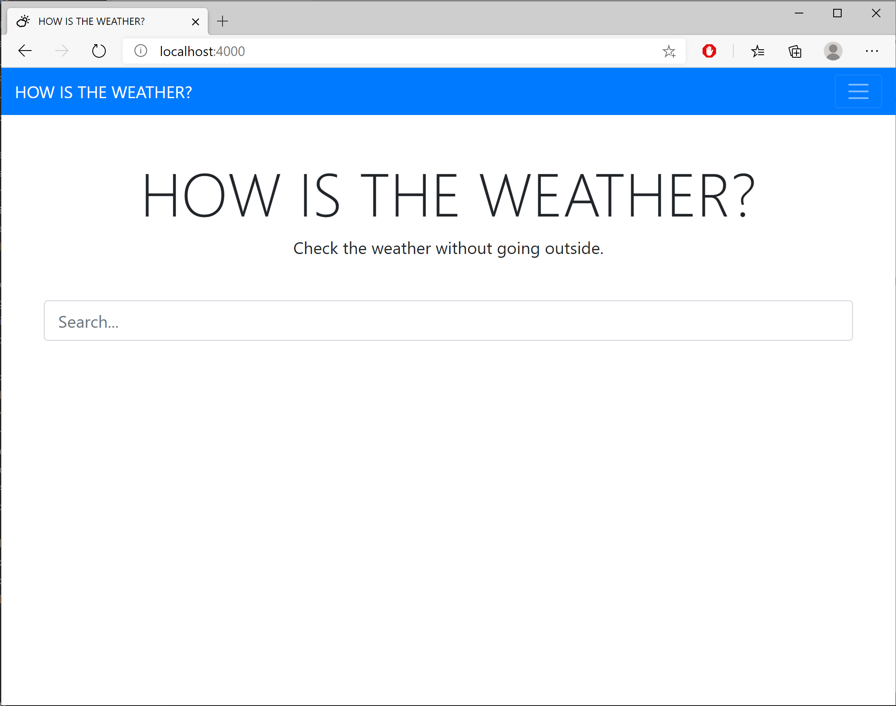
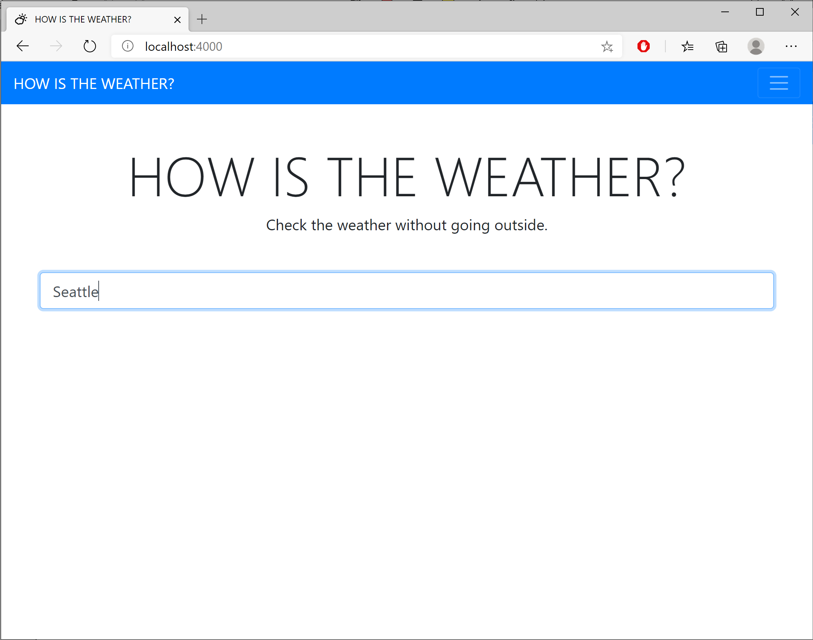
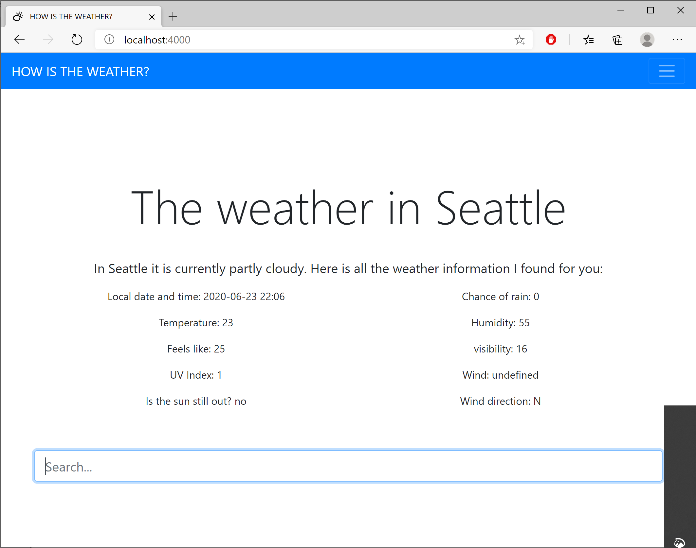

# HOW IS THE WEATHER?
A node JS weather app by mrivasperez/

## About
I created a simple weather app using Node.JS to retrieve location information and the current weather.

## Deployment
The application is deployed to Heroku. You can also deploy locally using the installation instructions:
### Local deploy
After downloading or cloning the repo, perform the following:
1. Open the project folder at the root in your terminal and run npm install to download all of the dependencies needed for this project.
2. Next, type ```node src/app.js``` to run the express server which defaults to localhost:4000

## Built with:
    Node.JS
    Express
    ESLint
    Bootstrap

## NPM packages used
    postman-request
    path
    handlebars


## Screenshots

> Screenshot of home page

> Screenshot of the search feature being used

> Screenshot of search results being displayed

